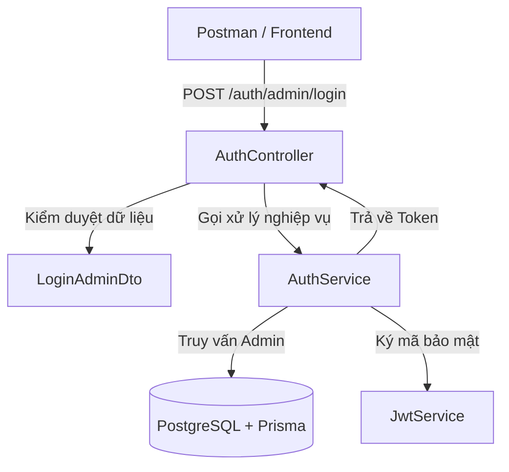

# 🌐 Hướng Dẫn Kỹ Thuật: Giải Mã Cơ Chế Định Tuyến (Routing) API `POST /auth/admin/login` trong NestJS

Tài liệu này giải thích chi tiết, từng bước cách đường dẫn API **`http://localhost:3000/auth/admin/login`** được hình thành trong dự án của bạn, làm thế nào mã nguồn quyết định đường dẫn đó và phương pháp giúp một lập trình viên xác định chính xác các Route API của bất kỳ dự án NestJS nào.

---

## 🗺️ 1. Công Thức Cấu Thành URL API

Đường dẫn hoàn chỉnh `http://localhost:3000/auth/admin/login` được tạo nên bởi sự kết hợp của **3 thành phần độc lập** trong cấu hình hệ thống:

```text
 http://localhost:3000  /  auth  /  admin/login
 └─────────┬─────────┘    └──┬───┘    └───┬───┘
     [1] Host & Port     [2] Prefix     [3] Action Route
```

### [1] Host & Port (`http://localhost:3000`)
* **Nơi cấu hình:** File `backend/src/main.ts`
* **Giải thích:** Đây là địa chỉ của máy chủ cục bộ (localhost) và cổng dịch vụ (port) mà ứng dụng NestJS của bạn đang lắng nghe để nhận các request.
* **Mã nguồn thực tế:**
  ```typescript
  // src/main.ts
  await app.listen(process.env.PORT ?? 3000); // Mặc định lắng nghe ở port 3000
  ```

### [2] Tiền tố Module / Controller Prefix (`/auth`)
* **Nơi cấu hình:** File `backend/src/auth/auth.controller.ts`
* **Giải thích:** NestJS gom nhóm các endpoint có cùng chủ đề vào một **Controller**. Tiền tố này là đường dẫn chung cho toàn bộ các API thuộc Controller đó.
* **Mã nguồn thực tế:**
  ```typescript
  // src/auth/auth.controller.ts
  @Controller('auth') // Định nghĩa tất cả API trong file này đều bắt đầu bằng /auth
  export class AuthController { ... }
  ```

### [3] Đường dẫn hành động / Action Route (`/admin/login`)
* **Nơi cấu hình:** Decorator `@Post('admin/login')` của phương thức trong Controller.
* **Giải thích:** Xác định phương thức HTTP (ở đây là `POST`) và đường dẫn chi tiết của hành động cụ thể.
* **Mã nguồn thực tế:**
  ```typescript
  // src/auth/auth.controller.ts
  @Post('admin/login') // Định nghĩa phương thức POST và endpoint con
  async loginAdmin(...) { ... }
  ```

👉 **Tổng hợp lại:**  
`Host & Port` + `Controller Prefix` + `Action Route` = `http://localhost:3000/auth/admin/login`

---

## 🛠️ 2. Các Bước Tạo Nên API Này Trong NestJS

Để tạo ra API này hoạt động trơn tru từ cơ sở dữ liệu đến giao diện, chúng ta đã xây dựng cấu trúc mô-đun hóa gồm các file sau:



### Bước 1: Định nghĩa Dữ liệu đầu vào (DTO)
Tạo file `src/auth/dto/login-admin.dto.ts` để kiểm soát nghiêm ngặt dữ liệu khách hàng gửi lên:
```typescript
import { IsNotEmpty, IsString, MinLength } from 'class-validator';

export class LoginAdminDto {
  @IsString()
  @IsNotEmpty({ message: 'Tên đăng nhập không được để trống' })
  username: string; // Cho phép điền cả username hoặc email

  @IsString()
  @IsNotEmpty({ message: 'Mật khẩu không được để trống' })
  @MinLength(6, { message: 'Mật khẩu phải có ít nhất 6 ký tự' })
  password: string;
}
```

### Bước 2: Viết Logic xác thực nghiệp vụ (Service)
Tạo file `src/auth/auth.service.ts` để xử lý kiểm tra tài khoản, băm mật khẩu Bcrypt và tạo token JWT:
```typescript
@Injectable()
export class AuthService {
  constructor(
    private prisma: PrismaService,
    private jwtService: JwtService,
  ) {}

  async validateAdmin(identifier: string, pass: string): Promise<any> {
    // 1. Tìm admin bằng Username hoặc Email
    const admin = await this.prisma.admin.findFirst({
      where: { OR: [{ username: identifier }, { email: identifier }] },
    });

    if (!admin) throw new UnauthorizedException('Tài khoản hoặc mật khẩu không hợp lệ');

    // 2. So sánh mật khẩu băm Bcrypt
    const isMatch = await bcrypt.compare(pass, admin.password);
    if (!isMatch) throw new UnauthorizedException('Tài khoản hoặc mật khẩu không hợp lệ');

    return admin;
  }

  async loginAdmin(admin: any) {
    const payload = { sub: admin.id.toString(), username: admin.username, role: admin.role };
    return {
      access_token: this.jwtService.sign(payload), // Ký token JWT
      admin: { id: admin.id.toString(), username: admin.username, fullName: admin.fullName, role: admin.role }
    };
  }
}
```

### Bước 3: Thiết lập Endpoint và Liên kết Định tuyến (Controller)
Tạo file `src/auth/auth.controller.ts` để đón nhận request và chuyển hướng xử lý:
```typescript
@Controller('auth') // Khai báo Prefix /auth
export class AuthController {
  constructor(private readonly authService: AuthService) {}

  @Post('admin/login') // Phương thức POST /admin/login
  @HttpCode(HttpStatus.OK) // Trả về HTTP 200 thay vì 201 mặc định của POST
  async loginAdmin(@Body() loginAdminDto: LoginAdminDto) {
    const admin = await this.authService.validateAdmin(
      loginAdminDto.username,
      loginAdminDto.password,
    );
    return this.authService.loginAdmin(admin);
  }
}
```

### Bước 4: Đăng ký Module trong Hệ thống
Đăng ký `AuthModule` vào module trung tâm `AppModule` (`src/app.module.ts`) để NestJS quét và tự động kích hoạt định tuyến khi máy chủ khởi chạy.

---

## 🔍 3. Làm Sao Lập Trình Viên Biết Được Hệ Thống Có Các Route Nào?

Khi tiếp cận một dự án NestJS có sẵn, có **3 phương pháp chính** để bạn quét và biết được danh sách tất cả các Route API:

### Cách 1: Đọc Logs Khởi Chạy Của Máy Chủ (Dễ nhất & Trực quan nhất)
Mỗi lần bạn chạy lệnh khởi động máy chủ (`npm run start:dev`), NestJS CLI sẽ biên dịch toàn bộ hệ thống và in ra màn hình Terminal danh sách tất cả các Route được kích hoạt kèm theo phương thức HTTP của chúng.

Nhìn vào log Terminal của dự án của bạn khi chạy, bạn sẽ thấy các dòng dạng:
```text
[Nest] 12345  - 06/01/2026, 9:55:00 PM     LOG [RoutesResolver] AuthController {/auth}: +1ms
[Nest] 12345  - 06/01/2026, 9:55:00 PM     LOG [RouterExplorer] Mapped {/auth/admin/login, POST} route +2ms
```
👉 **Cách đọc:** NestJS thông báo đã liên kết thành công phương thức `POST` cho địa chỉ `/auth/admin/login`.

### Cách 2: Truy Vết Từ File Điều Hướng Trung Tâm (`src/app.module.ts`)
1. Bạn mở file `src/app.module.ts`.
2. Kiểm tra danh sách các Module được nhập vào trong mảng `imports` (Ví dụ: `AuthModule`, `UsersModule`, `AdminsModule`).
3. Mở file Module tương ứng (Ví dụ: `src/auth/auth.module.ts`) để xem thuộc tính `controllers`. Bạn sẽ thấy `controllers: [AuthController]`.
4. Mở file `AuthController`, xem decorator `@Controller('prefix')` ở trên đầu class để biết tiền tố, sau đó xem các decorator phương thức như `@Get()`, `@Post('path')` bên dưới. Ghép chúng lại là bạn có Route chính xác!

### Cách 3: Sử Dụng Swagger Document (Tự động hóa hoàn toàn)
NestJS hỗ trợ tích hợp thư viện `@nestjs/swagger` để tự động tạo ra một trang web tài liệu API trực quan dạng giao diện (thường chạy tại `http://localhost:3000/api` hoặc `http://localhost:3000/docs`). Trang này sẽ liệt kê 100% tất cả các Route hiện có trong dự án và cho phép bạn thử nghiệm trực tiếp tại đó!
