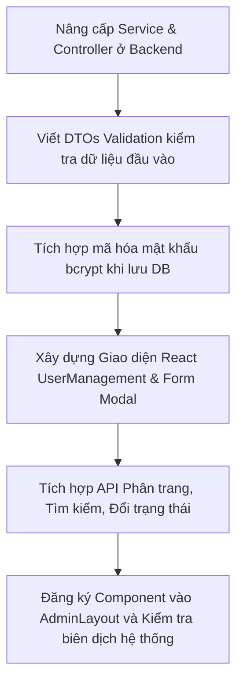

# 📋 KÊ HOẠCH TRIỂN KHAI PHÂN HỆ QUẢN LÝ NGƯỜI DÙNG (USER MANAGEMENT)

Mục tiêu là xây dựng một mô-đun **Quản lý Người dùng** toàn diện, bảo mật cao và tối ưu hiệu năng dành riêng cho quản trị viên (Admin). Mô-đun này cho phép Admin giám sát, tìm kiếm, phân trang dữ liệu, xem thống kê trực quan, và thực hiện đầy đủ các thao tác CRUD (Thêm, Xem, Sửa, Xóa) tài khoản khách hàng trực tiếp xuống PostgreSQL.

---

## 🛠️ PHẦN 1: PHÁT TRIỂN BACKEND (NestJS & Prisma)

Chúng ta sẽ nâng cấp module `users` hiện tại của NestJS để biến nó thành một API quản trị mạnh mẽ.

### 1. Nâng Cấp API Thống Kê (`GET /users/stats`)
* **Endpoint:** `GET /users/stats` (Yêu cầu `JwtAuthGuard`)
* **Chức năng:** Trả về số liệu thống kê thời gian thực từ cơ sở dữ liệu Postgres:
  * `totalUsers`: Tổng số lượng khách hàng đã đăng ký.
  * `activeUsers`: Số lượng khách hàng đang hoạt động bình thường (`isActive: true`).
  * `blockedUsers`: Số lượng khách hàng đang bị khóa (`isActive: false`).
  * `totalLoyaltyPoints`: Tổng số điểm tích lũy hệ thống.

### 2. Thiết Kế API Lấy Danh Sách Phân Trang & Tìm Kiếm (`GET /users`)
* **Endpoint:** `GET /users?page=...&limit=...&search=...` (Yêu cầu `JwtAuthGuard`)
* **Chức năng:**
  * Hỗ trợ phân trang để tránh tải hàng ngàn bản ghi cùng lúc gây sập server.
  * Tìm kiếm không dấu / không phân biệt chữ hoa thường (Case-Insensitive Search) theo các trường: `fullName`, `email`, `phone`.
  * Sắp xếp danh sách người dùng mới đăng ký lên đầu tiên (`createdAt: 'desc'`).

### 3. API Thêm Mới Tài Khoản Admin-side (`POST /users`)
* **Endpoint:** `POST /users` (Yêu cầu `JwtAuthGuard`)
* **Kiểm tra nghiệp vụ:**
  * Bắt buộc có `fullName`, `email`, `password`.
  * Tự động kiểm tra trùng lặp `email` hoặc `phone` trên cơ sở dữ liệu.
  * **Bảo mật:** Sử dụng `bcrypt` mã hóa mật khẩu trước khi lưu vào DB:
    ```typescript
    const hashedPassword = await bcrypt.hash(dto.password, 10);
    ```

### 4. API Chỉnh Sửa Tài Khoản (`PUT /users/:id` hoặc `PATCH /users/:id`)
* **Endpoint:** `PATCH /users/:id` (Yêu cầu `JwtAuthGuard`)
* **Chức năng:** Cho phép cập nhật tất cả thông tin: Tên, Số điện thoại, Địa chỉ, Điểm tích lũy, Trạng thái kích hoạt, và đổi mật khẩu mới (nếu có nhập thì tự mã hóa `bcrypt`).
* **Kiểm tra nghiệp vụ:** Kiểm tra trùng lặp Email/Phone đối với các tài khoản khác khi đổi thông tin.

### 5. API Xóa Tài Khoản (`DELETE /users/:id`)
* **Endpoint:** `DELETE /users/:id` (Yêu cầu `JwtAuthGuard`)
* **Chức năng:** Xóa cứng tài khoản khách hàng khỏi cơ sở dữ liệu sau khi xác thực quyền Admin.

---

## 🎨 PHẦN 2: PHÁT TRIỂN FRONTEND (React + Tailwind)

Chúng ta sẽ thiết kế một bảng điều khiển cao cấp tại `/admin` dành riêng cho quản lý người dùng với các tiêu chuẩn thiết kế premium.

### 1. Giao Diện Bảng Điều Khiển Chính (`UserManagement.tsx`)
* **Thống kê dạng thẻ (Metric Cards):** 3 khối hiển thị thống kê (Tổng User, Đang hoạt động, Đang khóa) với màu sắc chuyển sắc (Gradient) hiện đại, bo tròn góc `rounded-2xl`, có hiệu ứng hover phản hồi linh hoạt.
* **Bộ lọc tìm kiếm chung:** Sử dụng component `AdminSearchFilter` đã phát triển để mang lại sự đồng bộ.
* **Bảng dữ liệu người dùng đẳng cấp:**
  * Hiển thị Avatar (hình tròn có tên chữ cái đầu nếu không có ảnh đại diện).
  * Hiển thị Badge Email & Số điện thoại phong cách Glassmorphism.
  * Cột Điểm tích lũy (`Loyalty Points`) màu sắc nổi bật.
  * Công tắc chuyển đổi nhanh trạng thái hoạt động trực tiếp trên hàng của bảng.
  * Các nút hành động Sửa, Xóa chuyên nghiệp.
* **Bộ phân trang (Pagination Bar):** Nút chuyển trang có số lượng trang thực tế, nút `Trước`, `Sau` được xử lý logic chặt chẽ.

### 2. Biểu Mẫu Nhập Liệu Trượt Lên (`UserFormModal.tsx`)
* Thiết kế biểu mẫu Pop-up sang trọng gồm đầy đủ các trường nhập liệu:
  * **Hàng 1:** Họ & Tên | Số điện thoại
  * **Hàng 2:** Email | Mật khẩu (Chỉ hiển thị bắt buộc khi thêm mới, là tùy chọn khi chỉnh sửa)
  * **Hàng 3:** Điểm tích lũy | Trạng thái hoạt động (Dạng công tắc gạt)
  * **Khu vực Địa chỉ:** Tỉnh/Thành phố | Quận/Huyện | Phường/Xã | Số nhà cụ thể
* Hiển thị nút tải quay vòng (`isSaving`) khi bấm lưu và tự động cập nhật bảng dữ liệu sau khi lưu thành công.

### 3. Tích hợp Hộp thoại xác nhận (`AdminConfirmModal`)
* Khi bấm nút xóa người dùng, hệ thống kích hoạt cửa sổ xác nhận chung của Admin để tăng độ nhất quán và chuyên nghiệp.

---

## 🚀 PHẦN 3: CÁC BƯỚC THỰC HIỆN TRIỂN KHAI CHI TIẾT



1. **Bước 1 (Backend):** Tạo các tệp DTO đầu vào, viết hàm truy vấn Prisma phân trang & thống kê trong `UsersService`, cấu hình bảo mật `JwtAuthGuard` trong `UsersController`.
2. **Bước 2 (Frontend):** Viết component `UserFormModal.tsx` với đầy đủ các ô nhập liệu địa chỉ và thông tin cơ bản.
3. **Bước 3 (Frontend):** Thiết kế trang `UserManagement.tsx` tích hợp lấy dữ liệu API thời gian thực, quản lý phân trang và tìm kiếm debounced 300ms.
4. **Bước 4 (Frontend):** Khai báo và kết nối tab `users` trong `AdminLayout.tsx` để thay thế dòng text giả lập tạm thời.
5. **Bước 5 (Kiểm thử):** Biên dịch toàn bộ hệ thống để đảm bảo chất lượng vận hành cao nhất.
